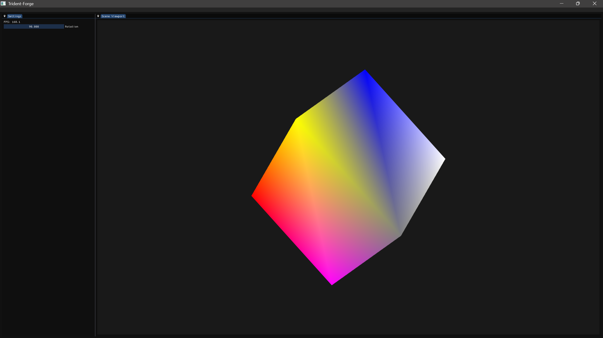

# Trident 🛠️💥

**Trident** is a modular, real-time 3D physics engine built in C++ using OpenGL for rendering and GLFW for context/window management. It is designed to power simulations and games, featuring a level editor (`Forge`) built with ImGui and ImGuizmo for intuitive scene interaction.

---

## Features

- 🔷 **Cross-platform 3D Physics Engine**
  - Custom physics simulation (WIP)
  - Modular architecture for core engine and application layer

- 🖼️ **Editor Viewport**
  - Real-time scene rendering with framebuffer-based viewport
  - ImGui UI integration for controls, tools, and future entity systems

- 🧰 **Rendering**
  - OpenGL 4.3 core profile
  - Shader abstraction and uniform management
  - GLM for math and transformations

- 🏗️ **Custom Engine Structure**
  - `Trident` – dynamic library with rendering, window, event, and physics code
  - `Forge` – level editor using ImGui and OpenGL
  - CMake build system with modern presets and organized output

---

## Screenshots

<p align="center">
  
</p>

---

## Getting Started

### 📦 Prerequisites

- C++20 compatible compiler (tested with MSVC)
- [CMake](https://cmake.org/) ≥ 3.22
- Git
- OpenGL drivers
- Windows OS (currently tested platform)

### 📁 Clone the Repository

```bash
git clone --recursive https://github.com/ThatTanishqTak/Trident.git
cd Trident/Scripts
Build-Windows.bat