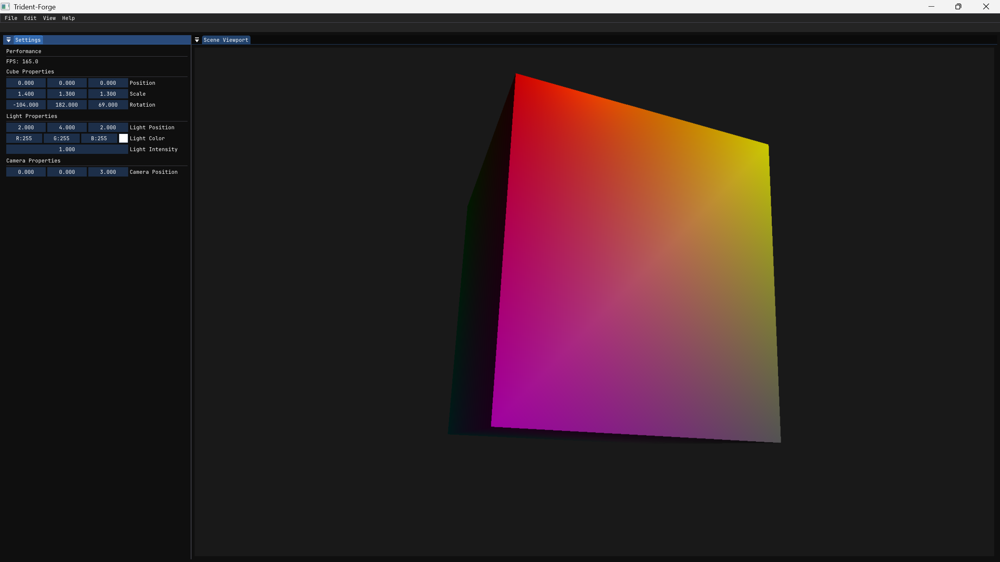

# Trident

**Trident** is a modular, real-time 3D physics engine developed in C++ using OpenGL for rendering and GLFW for window and context management. It is designed for simulations and game development, and includes a level editor (`Trident-Forge`) built with ImGui and ImGuizmo (in progress) for interactive scene editing.

---

## Features

### 3D Physics Engine
- In-progress custom physics simulation
- Modular architecture separating core engine and application layers

### Editor Viewport
- Real-time scene rendering with a framebuffer-based viewport
- ImGui integration for UI controls and tools
- Support for an entity system (planned)

### Rendering System
- OpenGL 4.3 core profile
- Shader abstraction with support for uniform management
- GLM-based mathematical operations and transformations

### Engine Structure
- **Trident** – core static library containing rendering, windowing, event handling, and physics systems
- **Trident-Forge** – standalone level editor built on top of the engine
- Modern CMake-based build system with organized binary and intermediate output directories

---

## Screenshots

<p align="center">
  
</p>

---

## Getting Started

### Prerequisites

- C++20 compatible compiler (tested with MSVC)
- [CMake](https://cmake.org/) version 3.22 or newer
- Git
- OpenGL-compatible graphics drivers
- Windows (primary tested platform)

### Clone the Repository

```bash
git clone --recursive https://github.com/ThatTanishqTak/Trident.git
```

### Build the Project

```bash
cd Trident/Scripts
Build-Windows.bat
